# DMToCSharp (DM-C-)

> A high-performance, bidirectional compiler, transpiler, and runtime execution engine bridging BYOND's DreamMaker (DM) language and C# (.NET).

[](LICENSE)
[]()
[]()
[-success.svg)]()

---

## Table of Contents / İçindekiler
- [Overview](#overview)
- [Architecture](#architecture)
- [Key Features](#key-features)
- [Space Station 13 Runtime Subsystems](#space-station-13-runtime-subsystems)
- [Installation & Build](#installation--build)
- [CLI Reference & Usage](#cli-reference--usage)
  - [Compiling DreamMaker to C# (DM -> C#)](#compiling-dreammaker-to-c-dm---c)
  - [Transpiling C# to DreamMaker (C# -> DM)](#transpiling-c-to-dreammaker-c---dm)
  - [Running the Test Suite](#running-the-test-suite)
- [Supported Language Features](#supported-language-features)
- [Code Examples](#code-examples)
  - [Example 1: DreamMaker to C# Compilation](#example-1-dreammaker-to-c-compilation)
  - [Example 2: C# to DreamMaker Transpilation](#example-2-c-to-dreammaker-transpilation)
- [Project Directory Structure](#project-directory-structure)
- [License](#license)

---

## Overview

**DMToCSharp** is an end-to-end compiler infrastructure and runtime engine that enables bidirectional source transformation between BYOND DreamMaker (`.dm` / `.dme`) and C# source code (`.cs`), along with native execution capabilities for complex SS13 (Space Station 13) codebases such as PsychonautStation and /tg/station.

---

## Architecture

The compiler is organized into independent, decoupled phases adhering to standard compiler construction principles:

```mermaid
graph TD
    subgraph DM to CSharp Pipeline
        A[DreamMaker Source .dm / .dme] --> B[DM Preprocessor]
        B --> C[DM Lexer / Indentation Engine]
        C --> D[DM Pratt & Recursive Descent Parser]
        D --> E[DM Abstract Syntax Tree - AST]
        E --> F[Semantic Object Tree Analysis]
        F --> G[C# Source Code Emitter]
        G --> H[Generated C# Source Code .cs]
        H --> I[C# Roslyn / csc.exe Compiler]
        I --> J[Standalone Native Binary .exe]
    end

    subgraph CSharp to DM Pipeline
        K[C# Source File .cs] --> L[C# Lexical Analyzer]
        L --> M[C# Parser]
        M --> N[C# AST Model]
        N --> O[DreamMaker Code Emitter]
        O --> P[Generated DreamMaker Source .dm]
    end
```



---

## Key Features

- **Bidirectional Pipeline**:
  - **DM -> C#**: Parses DreamMaker code, analyzes the object tree, resolves prototype inheritance, and emits optimized C# source code ready for compilation with `csc.exe`.
  - **C# -> DM**: Parses C# class and method declarations, variable bindings, and control structures, translating them back to clean BYOND DreamMaker syntax.
- **Complete DM Preprocessor**:
  - Full support for directives: `#include`, `#define`, `#undef`, `#ifdef`, `#ifndef`, `#if`, `#elif`, `#else`, `#endif`.
  - Recursive resolution of BYOND Environment (`.dme`) project trees.
  - Macro parameter evaluation, stringification (`#`), and token pasting (`##`).
- **Semantic Type Hierarchy (`DMObjectTree`)**:
  - Full support for standard BYOND root types: `/datum`, `/atom`, `/atom/movable`, `/obj`, `/mob`, `/turf`, `/area`, `/client`, `/world`, `/list`.
  - Deep prototype inheritance, variable defaults propagation, procedure overloading, and super calls (`..()`).
- **Implicit Return Variable `.` (Dot Return)**:
  - Native support for BYOND's implicit dot return variable semantics (`. = list()`, `return .`).

---

## Space Station 13 Runtime Subsystems

To empower complete execution of SS13 game code bases (including **PsychonautStation**), DMToCSharp embeds native engine subsystems:

1. **DMM Map Parser & 3D Spatial Grid (`DMMParser`, `DMSpatialGrid`)**:
   - Parses BYOND `.dmm` map format tile dictionaries and 3D coordinate matrices.
   - Instantiates `/turf`, `/area`, and `/obj` instances in a 3D coordinate space `(x, y, z)`.
   - Comprehensive spatial ray-casting: `range()`, `orange()`, `view()`, `oview()`, `locate(x,y,z)`, `get_step()`, `get_dist()`, `get_dir()`, `step()`.
2. **Master Controller (MC) & Subsystem Engine (`MasterController`, `DMSubsystem`)**:
   - Manages asynchronous, priority-queued ticking for SS13 subsystems (`SSair`, `SSmachines`, `SSlighting`, `SSmobs`).
   - Dynamic tick budgeting (`world.fps`, `world.tick_lag`), crash recovery, and runtime diagnostics.
3. **Rust-g Native & Managed FFI Bridge (`RustGBridge`)**:
   - C# native fallback and FFI routing for BYOND external library calls (`call_ext` / `rust_g.dll`):
     - SHA256 / MD5 cryptographic hashing (`rustg_hash_string`, `rustg_hash_file`).
     - 2D/3D Simplex/Perlin noise algorithms for asteroid and mining map generation (`rustg_noise_2d`).
     - High-speed JSON validation and formatting (`rustg_json_is_valid`).
4. **TGUI Web Interface Manager (`TGUIManager`)**:
   - Manages datum controller state synchronization and WebSocket action handling (`ui_data`, `ui_act`) for modern React-based SS13 interfaces.

---

## Installation & Build

The codebase is engineered for maximum portability on Windows systems and compiles with .NET Framework 4.0/4.8 or the modern .NET SDK.

### Compiling from Source

Run the automated build script:

```cmd
:: Using the Windows Batch script:
build.bat

:: Or using PowerShell:
powershell -ExecutionPolicy Bypass -File build.ps1
```

The compiled binary will be placed at `bin\DMToCSharp.exe`.

---

## CLI Reference & Usage

### Compiling DreamMaker to C# (DM -> C#)

Translate a `.dm` or `.dme` source file to C# code:

```bash
# Generate C# source file:
bin\DMToCSharp.exe compile source.dm -o output.cs

# Compile directly to executable binary:
bin\DMToCSharp.exe compile source.dm --exe game.exe

# Compile and immediately execute:
bin\DMToCSharp.exe compile source.dm --run

# Pass preprocessor definitions:
bin\DMToCSharp.exe compile source.dm -DDEBUG -DMAX_PLAYERS=50 --run
```

### Transpiling C# to DreamMaker (C# -> DM)

Translate a C# source file back into DreamMaker syntax:

```bash
bin\DMToCSharp.exe cs2dm InputClass.cs -o OutputFile.dm
```

### Running the Test Suite

Execute the internal verification test suite covering syntax constructs, type inheritance, associative lists, control flows, and complex game loops:

```bash
bin\DMToCSharp.exe test
```

---

## Supported Language Features

| Feature Area | Support Status | Description |
|---|:---:|---|
| **Object Hierarchy** | Supported | `/datum`, `/atom`, `/obj`, `/mob`, `/turf`, `/area`, nested paths |
| **Dynamic Scoping** | Supported | `var/x`, `/var/global/y`, `this.GetVar()`, `this.SetVar()` |
| **Procedures & Overrides** | Supported | `proc/name()`, override declarations, `..()` super calls |
| **String Interpolation** | Supported | Full evaluation of embedded expressions: `"Score: [score + 10]"` |
| **List Data Structures** | Supported | 1-indexed collections and associative key-value dictionaries |
| **Control Flow** | Supported | `if/else`, `while`, `do-while`, `for`, `for-in`, `for-range`, `switch`, `try/catch` |
| **Stream Output Operators** | Supported | `world << expression` and standard console redirection |
| **Standard Library Builtins** | Supported | `istype`, `length`, `round`, `rand`, `roll`, `prob`, `locate`, `spawn` |
| **C# -> DM Transpiler** | Supported | Classes, fields, properties, procedures, control statements |

---

## Code Examples

### Example 1: DreamMaker to C# Compilation

**Input: DreamMaker (`tests/dm_to_cs/01_basics.dm`)**
```dm
/var/global/server_name = "DreamMaker Station"
/var/global/round_id = 42

/proc/add_numbers(a, b)
	return a + b

/proc/main()
	world << "=== DreamMaker Basics Test ==="
	world << "Server: [server_name], Round: [round_id]"
	
	var/x = 10
	var/y = 25
	var/sum = add_numbers(x, y)
	world << "10 + 25 = [sum]"
```

**Output: Generated C# Code**
```csharp
namespace DMCompiled
{
    public static class GlobalVars
    {
        public static DMValue server_name = (DMValue)"DreamMaker Station";
        public static DMValue round_id = (DMValue)42;
    }

    public static class GlobalProcs
    {
        public static DMValue add_numbers(DMValue a = default(DMValue), DMValue b = default(DMValue))
        {
            return (a + b);
        }

        public static DMValue main()
        {
            DMBuiltins.world_output((DMValue)"=== DreamMaker Basics Test ===");
            DMBuiltins.world_output(DMValue.Format("Server: ", GlobalVars.server_name, ", Round: ", GlobalVars.round_id));
            DMValue x = (DMValue)10;
            DMValue y = (DMValue)25;
            DMValue sum = GlobalProcs.add_numbers(x, y);
            DMBuiltins.world_output(DMValue.Format("10 + 25 = ", sum));
            return DMValue.Null;
        }
    }
}
```

---

### Example 2: C# to DreamMaker Transpilation

**Input: C# (`tests/cs_to_dm/01_classes_and_methods.cs`)**
```csharp
public class DM_mob_station_ai : DM_mob
{
    public DMValue power_level = 100;
    public DMValue security_status = "Green";

    public virtual DMValue report_status()
    {
        world.Output($"AI Status: Security is {security_status}, Power at {power_level}%");
        return power_level;
    }

    public virtual DMValue trigger_alarm(DMValue level)
    {
        security_status = level;
        world.Output($"ALERT: Station security changed to {level}!");
        return DMValue.Null;
    }
}
```

**Output: Generated DreamMaker Code**
```dm
/mob/station/ai
	var/power_level = 100
	var/security_status = "Green"
	proc/report_status()
		world << "AI Status: Security is [security_status], Power at [power_level]%"
		return power_level

	proc/trigger_alarm(level)
		security_status = level
		world << "ALERT: Station security changed to [level]!"
		return
```

---

## Project Directory Structure

```
opendreampiskonut/
├── src/
│   ├── Core/                  # AST nodes, DreamPath representation, diagnostics, and source locations
│   │   ├── Location.cs
│   │   ├── CompilerDiagnostic.cs
│   │   ├── DreamPath.cs
│   │   └── AST/
│   │       ├── DMASTNode.cs
│   │       ├── DMASTExpressions.cs
│   │       ├── DMASTStatements.cs
│   │       └── DMASTDefinitions.cs
│   ├── Preprocessor/          # Macro engine, environment file parser, directive evaluator
│   │   ├── DMMacro.cs
│   │   └── DMPreprocessor.cs
│   ├── Lexer/                 # Lexical scanner, token model, indentation tracker
│   │   ├── TokenType.cs
│   │   ├── Token.cs
│   │   └── DMLexer.cs
│   ├── Parser/                # Recursive descent and Pratt expression parser
│   │   └── DMParser.cs
│   ├── Semantics/             # Type tree construction, prototype inheritance resolution
│   │   ├── DMTypeDefinition.cs
│   │   └── DMObjectTree.cs
│   ├── Emitter/               # C# code emitter and code generator
│   │   └── CSharpEmitter.cs
│   ├── CSharpToDM/            # C# to DM transpiler subsystem (lexer, parser, emitter)
│   │   ├── CSharpAST.cs
│   │   ├── CSharpLexer.cs
│   │   ├── CSharpParser.cs
│   │   └── DMEmitter.cs
│   ├── Runtime/               # DreamMaker runtime library and standard types
│   │   ├── DMValue.cs
│   │   ├── DMList.cs
│   │   ├── DMObject.cs
│   │   ├── DMWorld.cs
│   │   ├── DMBuiltins.cs
│   │   ├── DMStandardTypes.cs
│   │   ├── Maps/              # 3D spatial grid, DMM parser, line-of-sight & movement
│   │   │   ├── DMMParser.cs
│   │   │   └── DMSpatialGrid.cs
│   │   ├── MC/                # Master Controller, priority queuing, subsystem ticker
│   │   │   ├── DMSubsystem.cs
│   │   │   └── MasterController.cs
│   │   ├── RustG/             # Rust-g FFI bridge (hashing, 2D/3D noise, JSON)
│   │   │   └── RustGBridge.cs
│   │   └── TGUI/              # TGUI datum UI states and WebSocket management
│   │       └── TGUIManager.cs
│   └── Program.cs             # Command-line driver and test orchestration
├── tests/
│   ├── dm_to_cs/              # DM -> C# compilation and execution integration tests
│   │   ├── 01_basics.dm
│   │   ├── 02_inheritance.dm
│   │   ├── 03_lists.dm
│   │   ├── 04_control_flow.dm
│   │   ├── 05_ss13_mini_game.dm
│   │   ├── 06_dmm_map_loading.dm
│   │   ├── 07_master_controller.dm
│   │   └── 08_rustg_and_spatial.dm
│   └── cs_to_dm/              # C# -> DM reverse transpilation tests
│       ├── 01_classes_and_methods.cs
│       └── 02_math_and_logic.cs
├── build.bat                  # Automated build script (Windows CMD)
├── build.ps1                  # Automated build script (PowerShell)
├── LICENSE                    # MIT License
└── README.md                  # Project Documentation
```

---

## License

This project is licensed under the [MIT License](LICENSE).
