# DMToCSharp 🌌 🔁 ⚡

> **A high-performance, bidirectional compiler and transpiler between BYOND's DreamMaker (`.dm` / `.dme`) and C# (`.cs`), complete with a dedicated runtime execution engine and Space Station 13 compatibility layer.**
>
> *DreamMaker (DM) ile C# arasında çift yönlü (DM ↔ C#) tam özellikli derleyici, kod dönüştürücü ve çalışma zamanı (Runtime) motoru.*

[](LICENSE)
[]()
[]()
[-success.svg)]()

---

## 📑 İçindekiler / Table of Contents
- [Öne Çıkan Özellikler / Features](#-öne-çıkan-özellikler--key-features)
- [Mimari & Tasarım / Architecture](#-mimari--tasarım--architecture)
- [Kurulum & Derleme / Installation & Build](#-kurulum--derleme--installation--build)
- [Kullanım Kılavuzu / Usage Guide](#-kullanım-kılavuzu--usage-guide)
  - [1. DM'den C#'a Derleme (DM -> C#)](#1-dmden-ca-derleme-dm---c)
  - [2. C#'tan DM'e Dönüştürme (C# -> DM)](#2-ctan-dme-dönüştürme-c---dm)
  - [3. Test Paketini Çalıştırma (Test Suite)](#3-test-paketini-çalıştırma-test-suite)
- [Desteklenen DreamMaker Özellikleri / Supported DM Features](#-desteklenen-dreammaker-özellikleri)
- [Örnekler / Examples](#-örnekler--examples)
  - [Örnek 1: DM Kodunun C#'a Dönüşümü](#örnek-1-dm-kodunun-ca-dönüşümü)
  - [Örnek 2: C# Kodunun DM'e Dönüşümü](#örnek-2-c-kodunun-dme-dönüşümü)
- [Proje Yapısı / Project Structure](#-proje-yapısı--project-structure)
- [Lisans / License](#-lisans--license)

---

## 🌟 Öne Çıkan Özellikler / Key Features

- 🔄 **Çift Yönlü Dönüşüm (Bidirectional Pipeline)**:
  - **DM ➔ C#**: DM AST analizi, OOP sınıf hiyerarşisi, dinamik var çözümleme ve native C# kaynak kod üretimi + `.exe` derlemesi.
  - **C# ➔ DM**: C# Lexer & Parser, sınıf/metot çözümleme ve BYOND `.dm` formatında temiz kod üretimi.
- ⚡ **Tam Özellikli Ön İşlemci (DM Preprocessor)**:
  - `#include`, `#define`, `#undef`, `#ifdef`, `#ifndef`, `#if`, `#elif`, `#else`, `#endif`.
  - BYOND `.dme` ortam dosyalarını okuma ve proje ağacını otomatik çözümleme.
  - Makro genişletme, `#` stringification ve `##` token pasting desteği.
- 🧩 **DreamMaker Tip Sistemi ve Nesne Hiyerarşisi (DMObjectTree)**:
  - Standart BYOND tipleri (`/datum`, `/atom`, `/atom/movable`, `/obj`, `/mob`, `/turf`, `/area`, `/client`, `/world`, `/list`).
  - Çok seviyeli kalıtım (Multilevel inheritance) ve geçersiz kılma (`proc` / `var` overrides).
  - Üst metot çağrısı (`..()`) ve dinamik tip doğrulama (`istype()`).
- 🎮 **Zengin Çalışma Zamanı Kütüphanesi (DM Runtime Engine)**:
  - `DMValue`: Null, Number, String, List, Object, Path ve Resource türlerini destekleyen dynamic struct.
  - `DMList`: 1-indeksli liste, assosiyatif anahtar-değer eşlemeleri ve liste fonksiyonları (`len`, `Copy`, `Find`, `Cut`, `Join`).
  - `DMWorld`: Global oyun dünyası, çıktı yönetimi (`world << ...`) ve zamanlayıcı.
  - `DMBuiltins`: `round`, `abs`, `sqrt`, `sin`, `cos`, `min`, `max`, `rand`, `roll`, `prob`, `pick`, `locate`, `spawn`, `sleep`, `uppertext`, `lowertext`, `copytext`, `findtext`, `splittext`, `jointext`, `replacetext`, `alert`.

---

## 🏗 Mimari & Tasarım / Architecture

```mermaid
graph TD
    subgraph DM to CSharp [DM -> C# Pipeline]
        DMFile[DreamMaker File .dm / .dme] --> Preproc[DM Preprocessor]
        Preproc --> DMLex[DM Lexer / Indent Tracking]
        DMLex --> DMParse[DM Pratt & Recursive Descent Parser]
        DMParse --> DMAST[DM AST File]
        DMAST --> DMTree[Semantic DMObjectTree & Scoping]
        DMTree --> CSEmit[CSharp Emitter]
        CSEmit --> CSFile[Generated C# Code .cs]
        CSFile --> CSC[C# Compiler csc.exe]
        CSC --> EXE[Native Executable .exe]
    end

    subgraph CSharp to DM [C# -> DM Pipeline]
        CSInput[C# Source Code .cs] --> CSLex[C# Lexer]
        CSLex --> CSParse[C# Parser]
        CSParse --> CSAST[C# AST Unit]
        CSAST --> DMEmit[DreamMaker DMEmitter]
        DMEmit --> DMOutput[Generated DreamMaker .dm]
    end
```



---

## 🚀 Kurulum & Derleme / Installation & Build

Proje Windows ortamında .NET Framework 4.0/4.8 veya .NET SDK ile doğrudan derlenebilir.

### Hızlı Derleme (Windows Batch / PowerShell)

```cmd
# Batch script ile derleme:
build.bat

# veya PowerShell ile derleme:
powershell -ExecutionPolicy Bypass -File build.ps1
```

Derleme sonucunda `bin\DMToCSharp.exe` çalıştırılabilir dosyası üretilir.

---

## 📖 Kullanım Kılavuzu / Usage Guide

### 1. DM'den C#'a Derleme (DM -> C#)

Bir `.dm` veya `.dme` dosyasını C# koduna dönüştürmek ve isteğe bağlı olarak doğrudan `.exe` yapıp çalıştırmak:

```bash
# DM kodunu C# dosyasına dönüştür:
bin\DMToCSharp.exe compile game.dm -o game.cs

# DM kodunu C#'a dönüştür ve doğrudan .exe olarak derle:
bin\DMToCSharp.exe compile game.dm --exe game.exe

# DM kodunu derle ve hemen çalıştır:
bin\DMToCSharp.exe compile game.dm --run

# Ön işlemci makrosu tanımlayarak derle:
bin\DMToCSharp.exe compile game.dm -DDEBUG -DMAX_PLAYERS=50 --run
```

### 2. C#'tan DM'e Dönüştürme (C# -> DM)

Bir C# dosyasını DreamMaker (`.dm`) koduna dönüştürmek:

```bash
bin\DMToCSharp.exe cs2dm MyClass.cs -o MyClass.dm
```

### 3. Test Paketini Çalıştırma (Test Suite)

Dahili test paketini ve çift yönlü doğrulama senaryolarını çalıştırmak için:

```bash
bin\DMToCSharp.exe test
```

---

## 📋 Desteklenen DreamMaker Özellikleri

| Özellik | DMToCSharp Desteği | Açıklama |
|---|:---:|---|
| **Nesne Hiyerarşisi (Object Tree)** | ✅ Tam Destek | `/datum`, `/atom`, `/obj`, `/mob`, `/turf`, `/area` vb. |
| **Dinamik Değişkenler & Scope** | ✅ Tam Destek | `var/x`, `/var/global/y`, `this.GetVar()`, `this.SetVar()` |
| **Metotlar & Kalıtım** | ✅ Tam Destek | `proc/my_proc()`, override, `..()` super call |
| **String Interpolation** | ✅ Tam Destek | `"Hello [name], your score is [score + 10]"` |
| **Çoklu Liste Tipleri** | ✅ Tam Destek | Standart liste ve assosiyatif `list("key" = "val")` |
| **Kontrol Akışı** | ✅ Tam Destek | `if/else`, `while`, `do-while`, `for`, `for-in`, `for-range`, `switch`, `try/catch` |
| **Dünya & Çıktı Operatörü** | ✅ Tam Destek | `world << "text"`, `DMWorld.Instance.Output` |
| **Standart Kütüphane Fonksiyonları** | ✅ Tam Destek | `istype`, `length`, `round`, `rand`, `roll`, `prob`, `locate` vb. |
| **C# ➔ DM Transpiler** | ✅ Tam Destek | C# sınıfları, propertyler, metotlar, döngüler ➔ `.dm` |

---

## 💻 Örnekler / Examples

### Örnek 1: DM Kodunun C#'a Dönüşümü

**DreamMaker Girdisi (`tests/dm_to_cs/01_basics.dm`):**
```dm
/var/global/server_name = "DreamMaker Station"
/var/global/round_id = 42

/proc/add_numbers(a, b)
	return a + b

/proc/main()
	world << "=== DreamMaker Basics Test ==="
	world << "Server: [server_name], Round: [round_id]"
	
	var/x = 10
	var/y = 25
	var/sum = add_numbers(x, y)
	world << "10 + 25 = [sum]"
```

**Oluşturulan C# Kodu:**
```csharp
namespace DMCompiled
{
    public static class GlobalVars
    {
        public static DMValue server_name = (DMValue)"DreamMaker Station";
        public static DMValue round_id = (DMValue)42;
    }

    public static class GlobalProcs
    {
        public static DMValue add_numbers(DMValue a = default(DMValue), DMValue b = default(DMValue))
        {
            return (a + b);
        }

        public static DMValue main()
        {
            DMBuiltins.world_output((DMValue)"=== DreamMaker Basics Test ===");
            DMBuiltins.world_output(DMValue.Format("Server: ", GlobalVars.server_name, ", Round: ", GlobalVars.round_id));
            DMValue x = (DMValue)10;
            DMValue y = (DMValue)25;
            DMValue sum = GlobalProcs.add_numbers(x, y);
            DMBuiltins.world_output(DMValue.Format("10 + 25 = ", sum));
            return DMValue.Null;
        }
    }
}
```

---

### Örnek 2: C# Kodunun DM'e Dönüşümü

**C# Girdisi (`tests/cs_to_dm/01_classes_and_methods.cs`):**
```csharp
public class DM_mob_station_ai : DM_mob
{
    public DMValue power_level = 100;
    public DMValue security_status = "Green";

    public virtual DMValue report_status()
    {
        world.Output($"AI Status: Security is {security_status}, Power at {power_level}%");
        return power_level;
    }

    public virtual DMValue trigger_alarm(DMValue level)
    {
        security_status = level;
        world.Output($"ALERT: Station security changed to {level}!");
        return DMValue.Null;
    }
}
```

**Oluşturulan DreamMaker Kodu:**
```dm
/mob/station/ai
	var/power_level = 100
	var/security_status = "Green"
	proc/report_status()
		world << "AI Status: Security is [security_status], Power at [power_level]%"
		return power_level

	proc/trigger_alarm(level)
		security_status = level
		world << "ALERT: Station security changed to [level]!"
		return
```

---

## 📁 Proje Yapısı / Project Structure

```
opendreampiskonut/
├── src/
│   ├── Core/                  # AST, DreamPath, Konum ve Tanılayıcılar
│   │   ├── Location.cs
│   │   ├── CompilerDiagnostic.cs
│   │   ├── DreamPath.cs
│   │   └── AST/
│   │       ├── DMASTNode.cs
│   │       ├── DMASTExpressions.cs
│   │       ├── DMASTStatements.cs
│   │       └── DMASTDefinitions.cs
│   ├── Preprocessor/          # DM Makro ve Ortam (#include / #define) Motoru
│   │   ├── DMMacro.cs
│   │   └── DMPreprocessor.cs
│   ├── Lexer/                 # DM Tokenizer & Girinti (Indent/Dedent) İzleyici
│   │   ├── TokenType.cs
│   │   ├── Token.cs
│   │   └── DMLexer.cs
│   ├── Parser/                # DM Recursive Descent & Pratt Parser
│   │   └── DMParser.cs
│   ├── Semantics/             # Tip Ağacı, Hiyerarşi & Kapsam Analizi
│   │   ├── DMTypeDefinition.cs
│   │   └── DMObjectTree.cs
│   ├── Emitter/               # DM AST ➔ C# Kod Üreteci
│   │   └── CSharpEmitter.cs
│   ├── CSharpToDM/            # C# ➔ DM Transpiler Pipeline
│   │   ├── CSharpAST.cs
│   │   ├── CSharpLexer.cs
│   │   ├── CSharpParser.cs
│   │   └── DMEmitter.cs
│   ├── Runtime/               # DM Çalışma Zamanı & Standart Tipler
│   │   ├── DMValue.cs
│   │   ├── DMList.cs
│   │   ├── DMObject.cs
│   │   ├── DMWorld.cs
│   │   ├── DMBuiltins.cs
│   │   └── DMStandardTypes.cs
│   └── Program.cs             # CLI Driver
├── tests/
│   ├── dm_to_cs/              # DM ➔ C# ve Native Çalıştırma Testleri
│   │   ├── 01_basics.dm
│   │   ├── 02_inheritance.dm
│   │   ├── 03_lists.dm
│   │   ├── 04_control_flow.dm
│   │   └── 05_ss13_mini_game.dm
│   └── cs_to_dm/              # C# ➔ DM Transpiler Testleri
│       ├── 01_classes_and_methods.cs
│       └── 02_math_and_logic.cs
├── build.bat                  # Hızlı Derleme Scripti (Windows Batch)
├── build.ps1                  # Hızlı Derleme Scripti (PowerShell)
├── LICENSE                    # MIT Lisansı
└── README.md                  # Dokümantasyon
```

---

## 📜 Lisans / License

Bu proje [MIT Lisansı](LICENSE) altında lisanslanmıştır. Açık kaynaklıdır ve özgürce kullanılabilir, geliştirilebilir.
